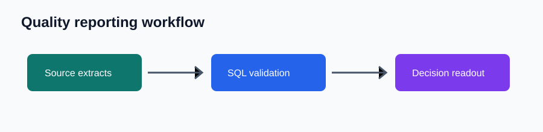
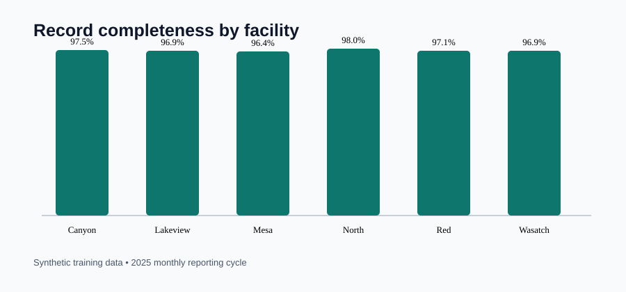
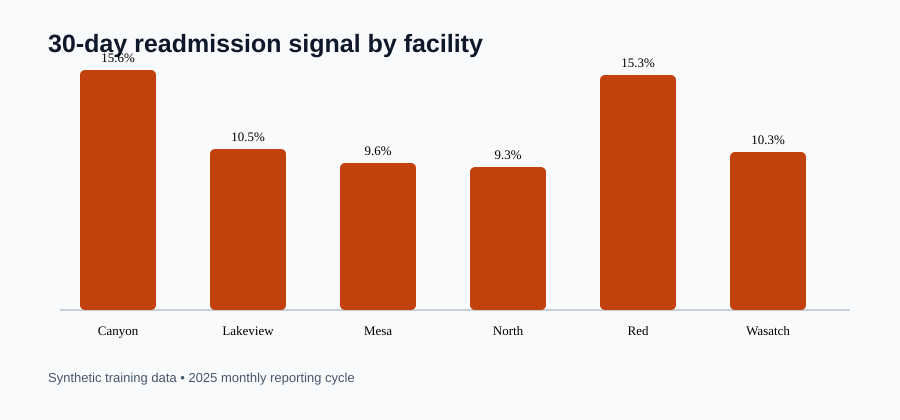

# Quality Reporting Readiness Pack

## Motivation

Healthcare quality dashboards are useful only when their inputs, denominators, and refresh status are understood. A facility leader should not have to guess whether a reported readmission or safety signal is supported by complete records and a current reporting run.

## What this project is

This reproducible analytics pack checks readiness of recurring healthcare-quality reporting. It combines five source-style synthetic tables with SQL controls, a facility-level readout, and evidence images for an operational review conversation.

## Why this problem matters

Large integrated delivery systems need a shared language for operational signals across hospitals, clinics, and health-plan-adjacent reporting. Trustworthy visibility requires documented definitions, complete records, known denominators, and a clear refresh exception path.

## Data or evidence used

`scripts/build_pack.py` deterministically generates 6,744 synthetic, de-identified encounter records across six fictional facilities and twelve monthly periods, plus discharge follow-up, safety-event, experience-survey, and dashboard-refresh tables. See [data_dictionary.md](data_dictionary.md). This is illustrative data, not Intermountain Health data.

## How the project works

1. The builder creates source-style CSV extracts.
2. [SQL checks](analysis/sql_checks.sql) document controls for completeness, readmission denominators, and refresh exceptions.
3. The analysis summarizes facility variation and outputs a concise decision readout.
4. Leaders decide where a data steward should investigate before an operational metric is acted on.



## Outputs and views

### Completeness should travel with any comparative metric



This supports an initial data-steward review: lower-completeness sources should be checked before comparative facility reporting is circulated.

### Outcome signals require a documented denominator



This is a synthetic signal, not a risk-adjusted performance measure. It demonstrates why each dashboard should expose discharge denominator logic and interpretation caveats.

## What the analysis says

The generated data shows ordinary facility-level variation in documentation completeness and the 30-day follow-up signal, plus dashboard-refresh exceptions. The reporting sequence should treat completeness and freshness as prerequisites, then route notable variation to a facility owner for review. Full interpretation is in [executive findings](analysis/executive_findings.md).

## Recommendations

1. Add completeness, denominator status, and refresh freshness to every recurring quality dashboard.
2. Create a weekly exception queue for facility data stewards, beginning with incomplete encounter records and unresolved discharge links.
3. Pair each released dashboard with a one-page readout: signal, confidence status, owner, action, and next monitoring date.
4. Track data-quality pass rate, reporting-cycle time, refresh exceptions, and dashboard use alongside outcome metrics.

## Repository structure

- `data/` — source-style synthetic CSV tables
- `analysis/` — SQL checks, plan, findings, and generated outputs
- `scripts/` — deterministic build script
- `docs/images/` — workflow and analytical evidence

## How to run or inspect

No third-party packages are needed.

```bash
python3 scripts/build_pack.py
```

Then inspect the generated CSV files in `data/`, SQL validation logic in `analysis/sql_checks.sql`, and findings in `analysis/`.

## Caveats and limitations

The data is synthetic and de-identified. The pack does not represent actual Intermountain Health facilities, patients, quality ratings, clinical outcomes, financial outcomes, or a production reporting system. It demonstrates analyst workflow—data validation, dashboard-ready definitions, and stakeholder communication—not clinical inference.
