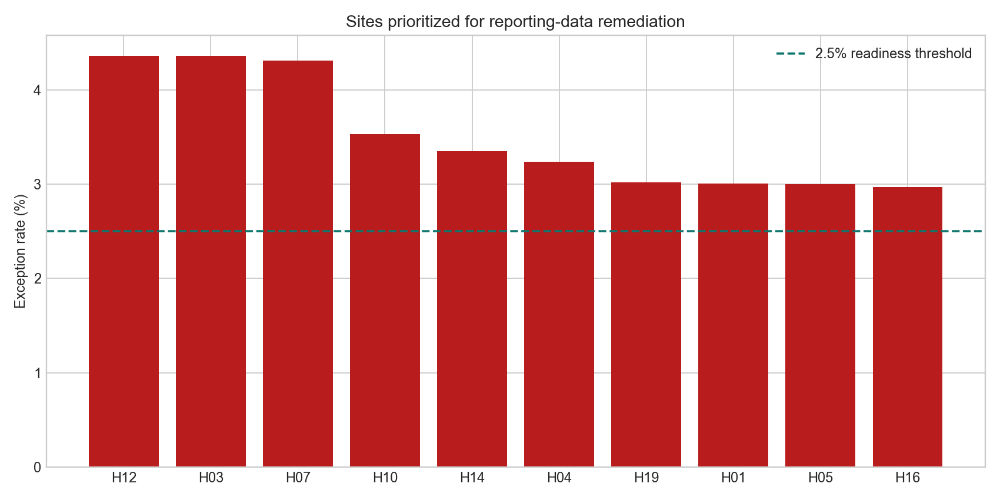
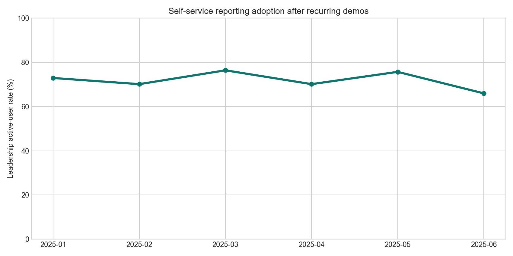

# Intermountain Quality Reporting Readiness Pack

## Motivation

Clinical and operational leaders can only act quickly when recurring reporting is both understandable and trustworthy. This pack demonstrates a practical workflow for surfacing encounter-data quality, report-refresh reliability, utilization signals, and leadership self-service adoption in one auditable reporting routine.

## What this project is

A reproducible, synthetic healthcare analytics pack for a regional reporting team. It pairs SQL validation checks with a site-level readiness queue and rendered evidence designed to support a weekly quality-and-operations review.

## Why this problem matters

An attractive dashboard is not enough when a late feed, missing discharge record, or failed validation can change an apparent utilization trend. Analysts need to partner with data architects on source integrity, explain signals in plain language, and demonstrate how leaders can consume a governed report independently.

## Data or evidence used

Four source-style CSV tables model 100k+ de-identified synthetic encounters, 1,200 quality events, 540 report refresh runs, and 18 report-adoption observations. Field definitions and limitations are in [data_dictionary.md](data_dictionary.md). The data is intentionally synthetic: it contains no patient information and makes no claim about Intermountain Health performance.

## How the project works

`scripts/build_artifact.py` deterministically creates source-style tables, SQLite analysis output, a site readiness queue, and two rendered charts. [analysis/sql_checks.sql](analysis/sql_checks.sql) contains the portable checks a reporting analyst could run before releasing a leadership view.

## Outputs and views

### Data-quality priority queue

The ranked view identifies sites where completeness or validity exceptions deserve a remediation huddle before results are treated as reporting-ready. The dashed line is the example 2.5% escalation threshold.



### Leadership self-service adoption

This trend turns demonstrations and hands-on training into a measurable outcome: the share of eligible leaders who actively use recurring reporting.



## What the analysis says

The evidence supports a simple operating sequence: validate source fields, disclose refresh health, prioritize affected sites, then review quality/utilization context with leaders. The scorecard is deliberately a readiness instrument, not a clinical-performance benchmark.

## Recommendations

1. Gate scheduled report distribution on completeness, validity, and duplicate-key checks; route sites above the example threshold to accountable data owners.
2. Make refresh status and validation-exception counts visible in the recurring leadership review.
3. Follow demonstrations with active-user and self-service-session monitoring to improve independent report consumption.

## Repository structure

```
data/                 synthetic source-style tables
analysis/             plan, SQL checks, findings, generated scorecards
scripts/              reproducible data and evidence generator
docs/images/          rendered evidence embedded above
```

## How to run or inspect

```bash
python3 -m pip install -r requirements.txt
python3 scripts/build_artifact.py
sqlite3 analysis/outputs/readiness_analysis.sqlite < analysis/sql_checks.sql
```

## Caveats and limitations

This is a portfolio demonstration built from synthetic, de-identified records. It does not model risk adjustment, clinical definitions, patient safety measures, HIPAA controls, or live health-system workflows. A production implementation would require governance approval, authoritative definitions, privacy review, and clinician/data-owner validation.
